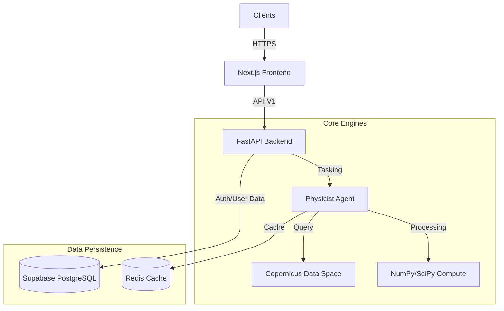

# AerisQ - Advanced Drought Detection Platform

**Physics-backed soil moisture analysis using Sentinel-1 SAR satellite interpretation.**

---

## 🌍 Executive Summary

**AerisQ** is an advanced geospatial analysis platform designed to detect early signs of drought and soil moisture anomalies. By leveraging **Synthetic Aperture Radar (SAR)** technology from the Sentinel-1 constellation, AerisQ sees through clouds and weather conditions to provide reliable, day-and-night soil dielectric assessment.

Unlike optical indices (NDVI) which only show vegetation stress *after* it occurs, AerisQ's **Physics Engine** analyzes the backscatter coefficient ($\sigma_0$) to estimate volumetric soil moisture directly, offering a leading indicator for water scarcity.

## � Key capabilities

### �🔬 The "Physicist" Engine
At the core of AerisQ is a proprietary analysis agent capable of processing raw satellite telemetry into actionable insights:
- **Radiometric Calibration**: Converts raw digital numbers into calibrated backscatter ($\sigma_0$ dB).
- **Speckle Filtering**: Implements **Lee Filtering** and advanced noise reduction to ensure signal clarity.
- **Incidence Angle Normalization**: Standardizes observations to a reference angle ($38^\circ$) for consistent temporal comparison.
- **Dielectric Analysis**: Maps radar reflectivity directly to soil moisture content using empirical physical models.

### 💻 Enterprise Frontend
- **Interactive AOI Selection**: Precision polygon drawing tools based on `Leaflet-Draw`.
- **Real-time Visualization**: Dynamic overlay of drought severity layers on global base maps.
- **Secure Architecture**: JWT-based authentication with role-based access control.
- **Reporting**: Automated generation of moisture analysis reports.

---

## 🏗️ System Architecture

AerisQ follows a modern, decoupled service architecture:

## 🛠️ Technology Stack

| Component | Technology | Description |
|-----------|------------|-------------|
| **Frontend** |   | Responsive React components with `leaflet` mapping. |
| **Backend** |   | High-performance async API with scientific computing libraries. |
| **Science** |   | Geospatial raster processing and statistical analysis. |
| **Satellite** | **Sentinel-1** (IW GRD) | C-Band Synthetic Aperture Radar data processing. |

---

## ⚡ Getting Started

### Prerequisites
- Node.js 18+
- Python 3.11+
- Sentinel-1 Data Access (CDSE Account recommended for live data)

---

## 📊 Scientific Methodology

AerisQ implements a multi-stage analysis pipeline compliant with ESA recommendations:

1. **Ingestion**: Retrieval of Sentinel-1 Ground Range Detected (GRD) products.
2. **Preprocessing**: Thermal noise removal and orbital correction.
3. **Analysis**:
   $$ \sigma_{0} (dB) = 10 \cdot \log_{10} \left( \frac{DN^2}{A_{n}^2} \right) $$
   *(Where $DN$ is the pixel intensity and $A_n$ is the calibration vector)*
4. **Classification**: Drought severity is classified based on deviation from historical baselines and absolute dielectric thresholds.

## 🛡️ Security & Privacy

- **Data Sovereignty**: User analysis data is processed ephemerally or stored in compliant regional databases.
- **Authentication**: Industry-standard JWT flows.
- **Secrets Management**: No hardcoded credentials; fully environment-variable driven configuration.

## 🤝 Contributing

We welcome contributions from the scientific and open-source community. Please read `CONTRIBUTING.md` for our code of conduct and pull request process.

---
© 2026 AerisQ Technologies. *Advanced Earth Observation Systems.*

